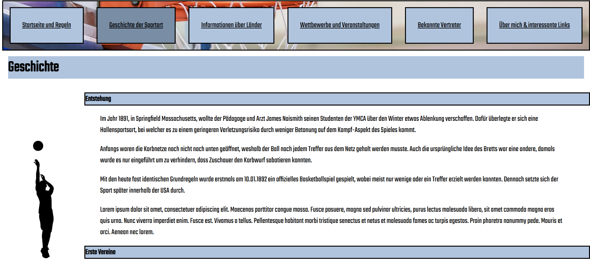
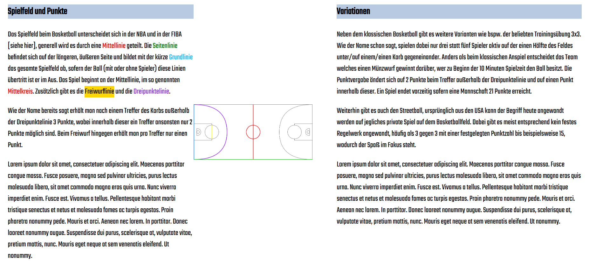
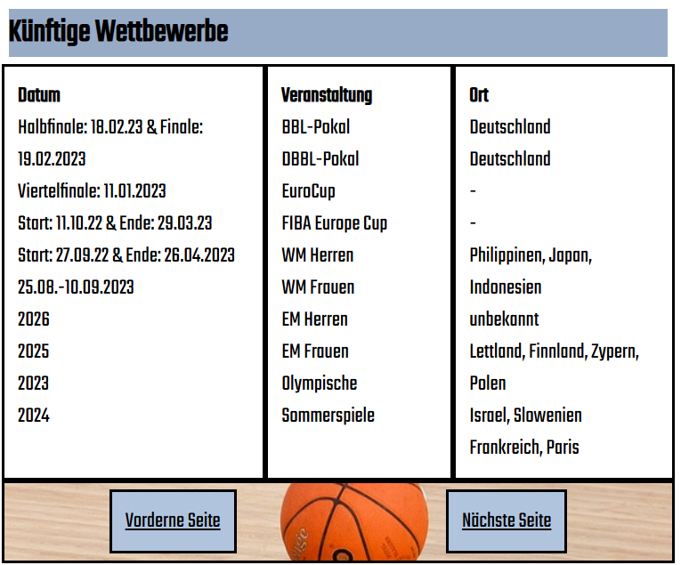

# Webauftritt-Informationstechnologien

Dies ist ein Webauftritt, erstellt im Rahmen des Moduls *Informationstechnologien* an der Hochschule der Medien, im 1. Semester (WS 2022/23). 
Es enthält ein responsives HTML/CSS-Projekt mit modernen Webstandards. Ziel war es, grundlegende Webentwicklung praxisnah umzusetzen und erste Erfahrungen zu sammeln.

## Technologien
- HTML
- CSS

## Funktionen 
- Strukturierte Website mit mehreren Seiten
- Responsive Design (mobilfreundlich)
- Verlinkungen und Navigation

## Vorschau & Beispiele

